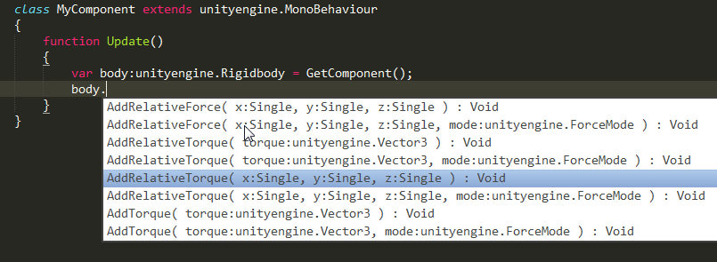

[tags]: haxe
[disqus]: 78559625982

# Haxe 3.1 is here!

The new release of Haxe compiler is finally out to be awesome around the world, thanks to its core developers and contributors (even I helped by bugging people and learning ocaml, yay!).

So, what's new there, apart from tons of bugfixes (especially related to the abstracts feature introduced in 3.0)? Let's see...

# Enum abstracts

This is something I have written about when it first appeared in Haxe Git repository. Enum abstracts, as the name implies are combination of enums and abstracts and is used to define a finite set of constant values of a given type with proper compile-time checking for exhaustiveness and correctness. You can read more about them in my [original article](http://nadako.tumblr.com/post/64707798715/cool-feature-of-upcoming-haxe-3-2-enum-abstracts), but here's what they look like:

    @:enum abstract State(Int)
    {
        var Idle = 0;
        var Walk = 1;
        var Fire = 2;
    }

The vars defined here actually become public static inline vars of the `State` type which is an abstract over `Int` as written above, you can access them as i.e. `State.Idle`, or even just `Idle` if the expression is known to be of that `State` type, just like Haxe enums, but in run-time they will become plain integers, because of how abstracts work in Haxe.

# Extractors

Extractors is a nice new pattern matching feature, allowing to apply preprocessing to a value before matching with a pattern in the `case` expression. The syntax is `expr => pattern`, where `expr` is a custom extractor expression in which the original value being matched is accessed with the `_` identifier. For example:

    var s = "hello";
    switch (s)
    {
        case _.toUpperCase() => "HELLO":
            trace(1);
        case StringTools.urlDecode(_) => "hello":
            trace(2);
        case "a" + _ => "ahello":
            trace(3);
    }

One thing that extractors help with is working with `haxe.macro.Type`, as it has `Ref<T>` objects that needs to be dereferenced before further matching, i.e. matching a `String` type would now look like this:

    var a = Context.getLocalType();
    switch (a)
    {
        case TInst(_.get() => {pack: [], name: "String"}, []):
        case _:
    }

# EnumValue.match

This is a handy little addition helping to check whether given value of an enum matches the required pattern or not, so instead of writing:

    var matches = switch (a) { case A(1): true; default: false; };

You can simply write:

    var matches = a.match(A(1));

Linking with .NET assemblies directly for C#
============================================

Similar to Flash and Java libraries, you can now directly add .NET libraries to the compiled application when compiling to C#. Haxe compiler now parses the .NET assembly file (i.e. the DLL), extracting and converting types to Haxe. This eliminates the need to write extern declarations for .NET libraries. The command-line option is `-net-lib MyLib.dll`. Here's a pic related: 

In addition to this feature, C# target now supports native .NET attributes, delegates and events. All these changes together should improve Haxe/C# interoperability a lot.

Besides these huge additions, C# target also received much of bug-fixing and other stabilization-related love.

# Generic build

This is also something I already [wrote about](http://nadako.tumblr.com/post/77754638526/new-haxe-feature-genericbuild) recently. This is a new type building facility available through macros and I think this is kind of huge feature and will have many uses (i describe one in my post).

The basic idea is that you can change or even build a completely new type for each _instance_ of a generic (parametrized) type. You specify the build function with `@:genericBuild` meta, just like with `@:build`-macros, but instead of returning array of fields for the type being build, the build function returns a whole new type. And the most important is that the `@:genericBuild`-macro will be executed for each combination of type parameters, so you can modify the type depending on that.

That allows, for example, to re-implement `@:generic`, as Simon Krajewski [has shown](https://gist.github.com/Simn/8ae509cc3824099c1567) in the original pull request, or replace `MacroType` with a better syntax, or implement a read-only type builder as I did myself. Read my [original article](http://nadako.tumblr.com/post/77754638526/new-haxe-feature-genericbuild) for more details.

# ECheckType syntax

Those who work with macros probably know about `ECheckType` - the wrapper expression that allows to check whether given expression unifies with given type. However, despite being an expression, there was no actual syntax to write it in your code and you could only generate it with a macro. Now there's a new syntax for that: `(expr : MyType)`, where `expr` is any expression and `MyType` is, well, your type :-) The result of this expression is typed as the given type, so it may be used to type the `Dynamic` expression, or trigger abstract `@:to` conversion. For example:

    static function getData():Dynamic return "hello";
    
    static function main()
    {
        trace((getData() : String).toLowerCase());
    }

# Typed AST

This is an addition to the Haxe macro API. You can now access the AST after it's fully processed and typed but before actual output generation. The data structure for that is `TypedExpr` from `haxe.macro.Type` module that was just a reference in 3.0, now it's a structure similar to `haxe.macro.Expr` but having type information and making much more sense from a program flow point of view. For example, instead of working with some _identifiers_, you work with _local vars_. This has various uses, such as static analysis or custom target generation, as shown by Heinz Hölzer's [hx2python](https://github.com/frabbit/hx2python).

# Context.getExpectedType

Talking about macro API, there is also another nice addition: `Context.getExpectedType` function returns the type of an expression being expected on the macro call site. For example, it returns `Int` for this macro call: `var a:Int = myMacroCall();`

# So...

Haxe 3.1 release seems to be more stable than 3.0, considering how many bugs was fixed and the new features are really making the language more expressive. I'd like to give special thanks to [Andy Li](https://github.com/andyli) who made Haxe unit test suite up and running on Travis CI thus improving stability of the whole Haxe project.
